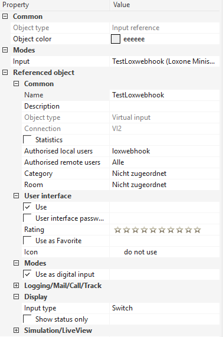

# Step by step instructions for Raspberry Pi

This guide leads you through the setup process for a typical Loxwebhook setup on your local network behind a consumer router.

## Prerequisites

1. Raspberry Pi 3 B+ with Raspbian Stretch up and running. Thought any Pi 2 or newer should work.

1. Access to the command line (Usually ssh or directly attached keyboard and monitor) and basic knowledge how to use it (copy and edit files).

1. Internet access to download Loxwebhook to your Pi

1. A DNS entry that points to your router and your router configured to forward port 443 to the IP address of your Pi to the port you want to run Loxwebhook on (default is 4433). Guides how to set up a dynamic DNS provider and port forwarding for all popular routers can be easily found.

    - You cannot use an IP address you must use a public known DNS name.

    - Using port 443 on the routers public interface is mandatory.

1. A Loxone Miniserver on the same network than the server running Loxwebhook.

    

## Installation

### Collect information

Make sure you know the following things before you start:

1. FQDN: Your public FQDN. You are getting this from your (dynamic)-DNS provider. It is something like `loxwebhook.example.com`

1. port: A free IP port on your Pi. Default is `4433` but you can choose any port that is not used by another service.

1. ip_address: IP address of your Loxone Miniserver.

1. user: User for you Loxone Miniserver. It is highly recommended to use a separate user for Loxwebhook only.

1. password: Password for the user above

### Check prerequisites

1. Install tcpdump
    ```bash
    sudo apt-get -y install tcpdump

    ```

1. Start tcpdump
    ```bash
    # sudo tcpdump port [port]
    # Example:
    sudo tcpdump port 4443

    ```

1. Open a browser on your PC and open `https://FQDN:port` Example: `https://loxwebhook.example.com`

    You should see multiple lines starting with the current date followed by `IP` followed by IP addresses and other unimportant stuff. It is normal and expected that your browser shows an error.
    ```bash
    # Example output:
    16:23:47.934665 IP 10.0.3.246.22 > 10.0.3.1.32855: Flags [P.], seq 2546457621:2546457817, ack 1824684201, win 355, options [...
    ```

1. You can close tcpdump with ctrl + c

### Install Loxwebhook

```bash
# Add repository key to your apt key ring
curl -L https://axxelg.github.io/loxwebhook/files/deb_repo_pub.key | sudo apt-key add -
# Add repository to /etc/apt/sources.list
echo "deb https://dl.bintray.com/axel/loxwebhook_deb stretch main" | sudo tee -a /etc/apt/sources.list
# Install loxwebhook
sudo apt-get update
sudo apt-get install loxwebhook

```

### Configuration

1. Edit `/etc/loxwebhook/config.toml` (sudo or as root)

    | Setting            | Value      | Example                  |
    |---------------     |------------|--------------------------|
    | PublicURI          | FQDN     | `loxwebhook.example.com` |
    | ListenPort         | port       | `4443`                   |
    | MiniserverURL      | ip_address |  `http://ip_address:80`  |
    | MiniserverUser     | user       | `loxwebhook`             |
    | MiniserverPassword | password   | `YourSecretPassword`     |

1. Create a Virtual Input in your Loxone Miniserver

    1. Use Loxone Config to create a new Virtual Input

    1. It's always a good idea to give your control a meaningful name

    1. Set the "Input Type" to "Switch"

    1. Set "Authorized local" for this Virtual Input to the user you created for Loxwebhook

    1. Make sure the "Mode" is set to "Use as digital input"

    1. Note or memorize the "Connection" of the Virtual Input. You can find it next to the "Object Type" in the properties of your Virtual Input

    1. Safe your changes to the Miniserver

        

1. Create controls file

    1. Use example file as a starting point
        ```bash
        sudo cp /etc/loxwebhook/controls.d/example.toml.disabled /etc/loxwebhook/controls.d/test.toml
        ```

    1. Edit `/etc/loxwebhook/controls.d/test.toml`

        1. Add you own AuthKey. Please read [Keys and Security](https://axxelg.github.io/loxwebhook/security_qa.html)

        1. Delete example AuthKeys

        1. Create your control

            1. Name: `Controls.testcontrol`

            1. Category: `"dvi"`

            1. ID: The number from the "Connection" property of your Virtual Input. Example: `2`

            1. Allowed: `["on", "off"]`

            1. AuthKeys: Name of the key you created.

        1. Delete example controls

        Example:

        ```toml
        [AuthKeys]
        testKey = "43b2c690-f281-42bb-af2d-979f5dbe9517"
        # Do not use this key anywhere it is public known and therefore not secure!

        [Controls]

            [Controls.testcontrol]
            Category = "dvi"
            ID = 7
            Allowed = [
                "on",
                "off",
            ]
            AuthKeys = [
                "testKey",
            ]
        ```

1. Test if everything works like expected

    1. Start Loxwebhook

        ```bash
        sudo systemctl restart loxwebhook.service
        # Restart in case loxwebhook is already running. If not it will do a normal start
        ```

    1. Start Loxone Config LiveView

    1. Open a browser type `https://FQDN/dvi/control/on?k=AuthKey` into the address bar and press enter. Example: `https://loxwebhook.example.com/dvi/testcontrol/on?k=43b2c690-f281-42bb-af2d-979f5dbe9517`

        You should see something like `<LL control="dev/sps/io/VI2/On" value="1" Code="200"/>` in your browser and the Virtual Input in Loxone Config should be active.